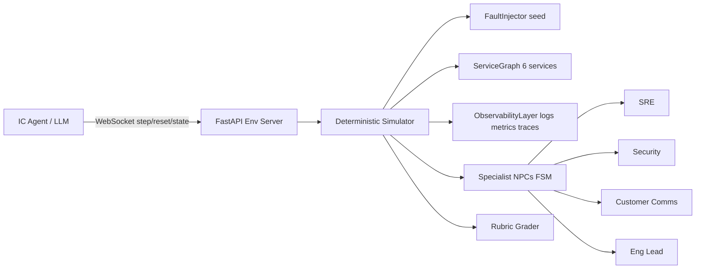
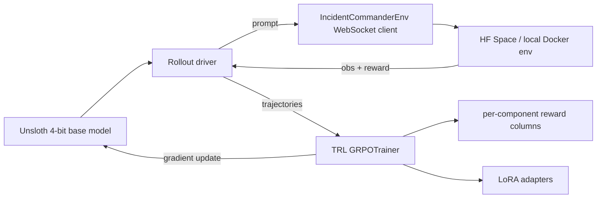

# Incident Commander OpenEnv — 48h Sprint Plan

## 1. Problem Statement

**Role simulated:** Incident Commander (IC) during a production outage at a simulated fintech microservices product. The IC coordinates specialist responders, queries observability data, executes mitigations, handles customer comms, and writes a post-mortem — mirroring real SRE practice (Google SRE book, PagerDuty IC framework).

**Why judges will like it:**
- SRE incident response is a multi-billion-dollar profession (Datadog, PagerDuty, Grafana). Clears the 30% "real-world task" bar that kills CartPole-style submissions.
- Multi-Actor: IC delegates to four named specialist NPCs (SRE, Security, Customer Comms, Eng Lead) with distinct tools and deterministic policies.
- Long-Horizon: 30–80 steps, sparse terminal signal (MTTR + blast radius) plus dense shaping.
- Hits both sponsor bonuses: Fleet AI (IC must *explain* sub-agent behavior in the post-mortem grader) and Halluminate (IC manages multiple actors to achieve the goal).
- Three tasks exercise *qualitatively* different reasoning: deductive (easy), attributional across system boundaries (medium), and low-signal reasoning about invisible state (hard) — addressing the rubric's "hard task must be qualitatively harder, not just quantitatively" criterion.

## 2. Environment Design

### 2.1 Architecture



- **Deterministic simulator** is non-negotiable: the checklist disqualifies non-reproducible graders. NPCs are rule/FSM-based (no LLM calls inside the env) so the same action sequence always produces the same score.
- **Service graph:** 6 services (api-gw, auth, payments, orders, inventory, notifications) with fixed dependency DAG, baseline latency/error-rate profiles, and ticking simulation time.

### 2.2 Observation (`models.py`)

Typed Pydantic `Observation` with fields:
- `alerts: list[Alert]` (severity, service, message)
- `dashboard: dict[str, ServiceHealth]` (latency_p99, error_rate, rps)
- `log_samples: list[LogLine]` (returned only when queried)
- `trace_spans: list[Span]` (returned only when queried)
- `npc_reports: list[NPCReport]` (filled after a delegation resolves)
- `chat_feed: list[Message]` (history of comms sent)
- `sim_time_sec: int`, `blast_radius_pct: float`, `revenue_loss_usd: float`
- `step_budget_remaining: int`, `last_action_result: str`

### 2.3 Action (`models.py`)

One discriminated-union `Action` with `op` enum:
- `query_logs | query_metrics | query_trace | query_audit | query_external_status` — info gathering (cheap)
- `delegate` — to `sre | security | comms | eng_lead` with task string
- `mitigate` — `restart | rollback | partial_rollback | scale | feature_flag | hold` (`hold` is an explicit no-op decision, so "do nothing" is a first-class choice and not just action omission)
- `communicate` — `status_page | customer_email | exec_update`
- `diagnose` — submit hypothesis `{service, root_cause_tag}`
- `resolve` — declare resolved
- `postmortem` — submit final JSON summary (required to end episode cleanly)

### 2.4 Reward Model (dense, bounded, [0,1] at episode level)

Six reward components, weighted sum normalized to 1.0:
- **Containment (0.25):** `1 - max(blast_radius_pct)` across episode.
- **MTTR (0.20):** exponential decay vs target time per scenario. If the task's ground-truth correct action is `hold`, MTTR is replaced by a "time-to-correct-attribution" clock (how long until the agent correctly calls `diagnose` and decides not to mitigate) so that doing-nothing-correctly is still rewarded.
- **Correct RCA (0.20):** tag match via `diagnose` action; partial credit for right service, full for service+cause.
- **Right mitigation (0.15):** matched mitigation action fires; destructive/wrong mitigations subtract. `hold` earns this component when the task's ground-truth mitigation is `hold` — so the reward function does not assume action is always better than inaction.
- **Comms SLA (0.10):** status-page update within T seconds of detection; penalty for spam.
- **Post-mortem quality (0.10):** programmatic check on JSON fields (service, cause, timeline events match log, actions taken, sub-agent summary factuality).

Anti-gaming: query spam capped, repeated identical actions zero-reward, over-mitigation penalized (any `rollback`/`partial_rollback` when ground-truth is `hold` costs the full mitigation component), post-mortem factuality checks compare against ground-truth event log.

### 2.5 Three Tasks (easy / medium / hard)

Each task exercises a different reasoning mode, signal density, and action mix:

- **Task 1 — `canary-regression` (easy).** A new canary release at 5% traffic is showing 2× the control group's error rate on the payments service. Dashboard signal is loud and unambiguous. The IC must confirm the regression via metrics+trace query, `diagnose` it, execute `rollback` on the canary, post a short status-page update, and write the post-mortem.
  - Reasoning mode: deductive (symptom → cause in one hop).
  - Correct mitigation: `rollback`.
  - Target baseline ≥ 0.6.
- **Task 2 — `third-party-attribution` (medium).** Payment-webhook ingestion starts failing. Is it us, our Stripe integration, or Stripe itself? The IC must pull a synthetic third-party status feed (`query_external_status`), compare its timeline to our own error onset, delegate to SRE for log correlation, and choose between three valid responses: `hold` + communicate (if clearly Stripe-side), `feature_flag` to route to a backup processor (if our integration), or `rollback` (if our recent deploy). Two of the three scenario variants have `hold` as ground-truth correct.
  - Reasoning mode: attribution across system boundaries; *inaction* can be the right answer.
  - Correct mitigation: scenario-dependent (`hold` / `feature_flag` / `rollback`).
  - Target baseline 0.3–0.6. Qualitative jump from easy: reward is maximized by *not* mitigating when the root cause is external.
- **Task 3 — `silent-data-corruption` (hard).** A customer report says account balances are off after a recent database migration. Zero alerts firing. Dashboards green. The IC must pull audit logs (`query_audit`), correlate anomalous writes to the deploy timeline, delegate to Eng Lead to size the affected cohort, decide between `partial_rollback` (restore one service's data) and forward-fix, and coordinate a targeted customer-comms message to only the affected cohort (not all users).
  - Reasoning mode: low-signal; reasoning about invisible state; blast-radius judgment.
  - Correct mitigation: `partial_rollback` + targeted `customer_email`.
  - Target baseline < 0.8. Qualitative jump from medium: no surface-level signal; must *seek* evidence the dashboards don't show.

Each task has a deterministic seed set (3 seeds per task for variance reporting) and a fixed episode step cap.

## 3. Repo Layout (matches the required structure)

```
incident_commander/
├── inference.py                 # root-level, OpenAI client, exact log format
├── openenv.yaml                 # name, version, 3 tasks, spaces
├── Dockerfile                   # root (mirrors server/Dockerfile for HF Space)
├── requirements.txt             # pinned
├── README.md                    # HF Space header + rubric sections
├── src/incident_commander/
│   ├── __init__.py
│   ├── models.py                # Pydantic Action/Observation/State
│   ├── client.py                # EnvClient subclass
│   ├── simulator/
│   │   ├── service_graph.py
│   │   ├── fault_injector.py    # 3 scenarios, seeded
│   │   ├── observability.py     # logs/metrics/traces generators
│   │   └── npcs.py              # 4 FSM specialists
│   ├── tasks/
│   │   ├── easy_canary_regression.py
│   │   ├── medium_third_party_attribution.py
│   │   └── hard_silent_data_corruption.py
│   └── graders/
│       ├── rubric.py            # weighted components, [0,1]
│       └── postmortem_check.py
├── server/
│   ├── app.py                   # create_app(IncidentEnv, Action, Observation)
│   ├── incident_env.py          # Environment.reset/step/state
│   └── Dockerfile
└── tests/
    └── test_smoke.py            # reset + step + determinism check
```

Key file references to match the builder guide ([Packaging & Deploying](https://meta-pytorch.org/OpenEnv/auto_getting_started/environment-builder.html)):

```python
# server/app.py
from openenv.core.env_server import create_app
from src.incident_commander.models import ICAction, ICObservation
from server.incident_env import IncidentEnv

app = create_app(IncidentEnv, ICAction, ICObservation, env_name="incident_commander")
```

## 4. 48-Hour Execution Schedule (hybrid sequence)

The full hackathon self-serve guide frames the project as **env → rewards → TRL training → deploy → demo**. Our first-pass plan was env-heavy and training-light; this revision pulls the training stack into the main schedule so the demo can show a measurable before/after instead of only a single baseline.

- **H0–H4 Scaffold** ✅ done. `openenv init`; Pydantic `ICAction`/`ICObservation`; stub `reset/step/state`; local Docker build validated.
- **H4–H12 Simulator core** ✅ done. 6-service graph, deterministic tick loop, observability generators, canary `BadDeployFault`, four NPC FSMs.
- **H12–H20 Easy task + grader + `inference.py`** ✅ done. Six reward components wired and validated; mock-oracle policy scores 0.872 end-to-end through HTTP/Docker; `[START]/[STEP]/[END]` log format passes the checklist validator. LLM baseline run gated on user-provided token.
- **H20–H26 Medium task (third-party-attribution).** Flesh out `ThirdPartyOutageFault.apply()` so payments webhook failures align to a synthetic Stripe status feed; three scenario variants (provider-side → `hold`; our-integration → `feature_flag` to backup processor; our-deploy → `rollback`). Tune MTTR target + grader edge cases so `hold` earns on the provider-side variant and the easy/medium baseline gap is ≥ 0.15.
- **H26–H28 HF Space early deploy.** `openenv validate` → `openenv push` to a public HF Space tagged `openenv`. Verify `/reset` returns 200; run a full easy+medium inference from a clean machine. Guide Section 13 is explicit: deploy early. Catching API/packaging issues now means the training loop in H28+ can target the same shared artifact instead of a moving local target.
- **H28–H36 Training stack: TRL + Unsloth + GRPO.** See Section 4.5 for the full breakdown. High level:
  - Load base model (default `unsloth/Qwen2.5-7B-Instruct`) in 4-bit via Unsloth.
  - Add a `training/rollout.py` driver that connects to the running env Space (or a local container) over `IncidentCommanderEnv` WebSocket and returns (prompt, completion, reward) trajectories.
  - Wire TRL `GRPOTrainer` with our per-step rubric reward as the scalar signal; log per-component rewards as separate metric columns (guide Section 15).
  - Record a **pre-training baseline** (mean ± std score over 3 seeds) before any training step runs.
  - Kick off a small initial run to validate the loop end-to-end (small batch, small step count). Verify generations look sensible before committing to a longer run.
- **H36–H40 Training tuning + reward-hacking audit.** Guide Section 8 + 15. Sample 20 generations at 3 checkpoints. Look for: shortcut diagnose spam, unused-field cheating, repeated identical actions, obvious post-mortem hallucination. If any component is dominating improvement at the expense of others, patch the rubric and retrain. Record post-training score on easy (mean ± std, 3 seeds).
- **H40–H42 Hard task (STRETCH).** Only if training tuning landed early and clean. Silent-data-corruption scenario: audit-log subsystem, migration-timeline generator, `partial_rollback` mitigation, targeted-cohort communication scoring.
- **H42–H46 Polish + final deploy.** Slim the Docker image (target < 500 MB, swap base to `python:3.11-slim`). Final `openenv.yaml` with tasks block. Pinned `requirements.txt` + `Dockerfile` at env root (per checklist). README updated with:
  - pre-training baseline table (Qwen/Qwen2.5-72B-Instruct + Llama-3.3-70B-Instruct on all implemented tasks, 3 seeds each),
  - **post-training baseline table** for the trained model on easy (the headline artifact),
  - reward-component breakdown table showing which components moved during training,
  - 3 sample full episode traces.
  Re-push to HF Space.
- **H46–H48 Demo prep.** Record: (1) pre-training model attempt on easy, (2) rubric output breakdown, (3) post-training model attempt on same seed, (4) measurable improvement, (5) short safeguards explanation — the guide's Section 19 "compelling demo" format almost verbatim.

## 4.5 Training Stack Details

Matches guide Sections 10–11 (TRL + Unsloth + OpenEnv, GRPO with verifiable rewards).

### 4.5.1 Architecture



### 4.5.2 Why these specific choices

- **GRPO over PPO.** Guide Section 11 flags GRPO as the more efficient successor for verifiable-reward settings. Our rubric is fully deterministic and programmatic — no learned reward model — which is the classic RLVR fit. Drops the value-head requirement vs PPO so we can fit a 7B model on a single consumer GPU.
- **Unsloth.** Guide Section 12 notes that rollout generation typically dominates RL-for-LLM wall time. Unsloth's fast-path generation + 4-bit LoRA training is the specific combination that makes one-GPU training practical in a 48h window. It also pairs cleanly with TRL's `GRPOTrainer`.
- **Qwen2.5-7B-Instruct.** Strong structured-output behavior with light system-prompt priming (critical for our JSON-action format), Unsloth has a ready-made 4-bit variant, and 7B fits in 24 GB VRAM for GRPO with LoRA. If compute is extra-tight we can fall back to `unsloth/Llama-3.2-3B-Instruct`.
- **Train on easy task only.** Guide Section 6: make success possible early. Canary-regression has the highest oracle ceiling (0.872) and the clearest dense reward signal; it's the only task where a small model is realistically going to cross the "non-zero reward" threshold in our time budget. Medium/hard tasks stay in the eval set.

### 4.5.3 Reward signal used for GRPO

We reuse the existing `RubricGrader` without modification. At the end of each rollout, GRPO gets `sum(step_rewards) = grader.score.total ∈ [0, 1]`. Per-component rewards are logged as separate metric columns for reward-hacking audits but don't enter the gradient. This matches the guide's "use multiple independent reward functions" advice (Section 7) — the agent sees the sum, but humans monitor each component independently so a reward-hack on one component is visible even when the total is going up.

### 4.5.4 Rollout driver responsibilities

- Spin up a fresh WebSocket session against the HF Space (or a local Docker container) per episode.
- Translate observations into the system/user prompt we already use in `inference.py` (single source of truth for the observation rendering).
- Call the base-model `.generate()` through Unsloth's fast path with temperature=0.7, top_p=0.95 during training (vs temperature=0.1 at eval time).
- Parse JSON action, submit via `env.step`, collect `reward` from the response.
- Terminate on `done=True` or `max_steps=25` — the same caps the checklist enforces on `inference.py`.
- Return `(prompt, completion, total_reward, per_component_rewards)`.

### 4.5.5 Anti reward-hacking checks

Per guide Section 8, pre-empt the likely shortcut patterns:

| Risk | Check |
|---|---|
| Agent spams `diagnose` until it guesses right | `diagnose_history` is inspected at checkpoints; if average diagnose calls per episode > 2, we penalise |
| Agent submits the post-mortem first and skips the rest | Post-mortem factuality check is anchored on the fault's ground-truth service+tag, which the agent only knows via actually diagnosing |
| Agent learns to pick `hold` unconditionally (no risk, no MTTR cost) | Already mitigated in Section 2.4: `hold` only credits mitigation when task ground-truth is `hold` |
| Agent picks the shortest path that happens to max one component | Per-component reward columns are logged; a per-component dashboard reveals when "total up" comes from "one component up, others down" |
| LLM hallucinates a trace_id or service name | Env-level validation returns `invalid ...` and the step burns budget — grader never credits it |

### 4.5.6 Save path (guide Section 16)

LoRA adapter checkpoints are saved with **Unsloth's merged-save path**, not the naive 4-bit → 16-bit merge. For the demo we either keep the adapters as-is and load with Unsloth at inference time, OR produce a merged 16-bit checkpoint via `model.save_pretrained_merged("...", tokenizer, save_method="merged_16bit")`. We do NOT manually upcast and merge — the guide calls this out explicitly as a quality-damage path.

### 4.5.7 Fallback if compute is unavailable

If no GPU is reachable in the training window, switch to a **best-of-N reward-guided sampling** demo:

- Sample `N=8` completions per observation from the frontier Qwen-72B baseline at temperature=0.9.
- Score each rollout's total episode reward against the rubric.
- Pick the max-reward completion as "post-training" for the demo.
- Document clearly in the README that this is a reward-guided inference-time strategy, not trained weights. It still exercises the verifier + demonstrates reward signal quality (the same content the guide's Section 2 "efficient in-context improvement" framing describes), but is explicit about what it is.

## 5. How We Chase the Bonus Prizes

- **Fleet AI — Scalable Oversight:** the post-mortem grader (`graders/postmortem_check.py`) programmatically verifies the IC's *explanation* of every sub-agent action against the simulator's ground-truth event log. That directly operationalizes "oversight agent explains behavior of other agents."
- **Halluminate — Multi-Actor:** four named NPCs with distinct tools and deterministic policies. Delegation quality is implicitly tested by the reward function: the RCA and mitigation components can only be earned by routing to the right specialist (e.g., `silent-data-corruption` requires Eng Lead to size the cohort; `third-party-attribution` requires SRE for log correlation), and the post-mortem factuality check verifies the IC can accurately describe what each NPC did. The IC is explicitly the managing actor.

Call both out in the README's first paragraph and in the pitch.

## 6. Suggestions to Maximize Score

1. **Publish baselines for ≥2 models + the trained model.** Pre-training baselines: `Qwen/Qwen2.5-72B-Instruct` and `meta-llama/Llama-3.3-70B-Instruct` via HF Router. Post-training baseline: our GRPO-trained `unsloth/Qwen2.5-7B-Instruct` on the easy task. The delta between the 7B baseline (pre) and 7B-trained (post) is the headline artifact — it's what the guide's Section 19 "evidence the model improved" explicitly asks for.
2. **Seed variance table** — run each task with 3 seeds, report mean ± std. Demonstrates reproducibility explicitly. Apply to both pre- and post-training numbers.
3. **Per-component reward deltas in the README.** A second table showing which of the six components moved during training. Directly addresses guide Section 15 ("watch individual reward columns, not just overall").
4. **README framing** — open with "This environment trains *incident commanders*, the most multi-agent role in modern SRE." Cite Google SRE book + two real public post-mortems your scenarios are modeled on (Cloudflare 2022, GitHub 2020). Shows depth.
5. **Determinism discipline.** Every random draw must go through a single seeded `random.Random` stored in `Simulator`. Test: replay the same action script twice; assert identical scores and identical per-component reward breakdowns.
6. **Domain knowledge talking points for the pitch** (so you can defend it in Q&A):
   - MTTR, blast-radius, and RCA match are the three canonical IC KPIs (PagerDuty, Atlassian IC frameworks).
   - Third-party-attribution is modeled on the standard "is it us or the provider" decision tree — and the right answer is often "communicate and wait," which is why `hold` is a first-class action and the reward explicitly rewards correct inaction.
   - Silent-data-corruption is modeled on real post-migration incidents (off-by-one schema changes); the hard mechanic is reasoning about state that isn't on any dashboard — the same competence that separates senior from junior ICs.
   - Dense shaping over sparse MTTR addresses the classic long-horizon credit-assignment problem.
   - GRPO + RLVR is the right fit because our rubric is fully programmatic and deterministic — no learned reward model needed.
7. **Cut-list if behind schedule.** Drop in this order, stopping at whichever saves enough time:
   1. Hard task (it's already a stretch).
   2. The 2nd pre-training baseline model (keep Qwen-72B).
   3. The trained-model run; fall back to best-of-N reward-guided demo (Section 4.5.7).
   4. Seed variance (report mean only).
   5. Docker slim (keep the 1.36 GB image; still under the 5 GB cap).
   Protect Docker + HF Space + easy task + medium task + deterministic graders + `inference.py` + at least one baseline + **some form of post-training evidence** at all costs — the first six are disqualifying-if-missing, the seventh is what takes the project from compliant to compelling.

Anything beyond this list (richer multi-actor behavior, dual-mode NPCs, extra failure scenarios, HTML timeline viewer) lives in Section 8 and is explicitly out of scope for the 48-hour build.

## 7. Risks and Mitigations

- **R1: Non-determinism sneaks in.** Mitigation: single seeded `np.random.Generator`, no wall-clock time, no external APIs inside the env, replay-determinism test in H20 and H36.
- **R2: Hard task is too hard or too easy.** Not in main critical path anymore (stretch). Still: tune against a cheap baseline model if the slot opens; target baseline score 0.4–0.7 with headroom below the 0.8 ceiling.
- **R3: Medium task's `hold` action rewards trivial inaction across all tasks.** Mitigation: `hold` only earns the mitigation component when the scenario's ground-truth is `hold`; picking `hold` on easy or hard zeroes that component.
- **R4: HF Space / Docker image > 1 GB.** Measured after scaffold (H4 checkpoint): 1.36 GB on the default `openenv-base` image — above our preferred target, well under the 5 GB checklist cap. Addressed in H42–H46 by switching the `FROM` to `python:3.11-slim` (expected ~300–500 MB).
- **R5: Scope creep.** Mitigation: the cut-list in Section 6; freeze env-feature scope at H28 so the whole H28+ block is strictly training/polish/demo.
- **R6: GRPO training doesn't converge, diverges, or plateaus at baseline.** Reward hacking is the most likely failure; exploit shortcuts come next. Mitigation: time-box the training window (H28–H40 is a hard ceiling), sample and hand-read 20 generations at 3 checkpoints, stop early if total reward climbs but per-component reward shows one component moving at the expense of others. **Fallback: best-of-N reward-guided sampling demo** (Section 4.5.7) — still exercises the verifier, is explicit about what it is, and keeps us in the compelling-demo slot.
- **R7: GPU unavailable or too small.** Unsloth targets ≥16 GB VRAM for 7B in 4-bit. Mitigation: pre-verify CUDA + memory at H26 before committing; fall back to `unsloth/Llama-3.2-3B-Instruct` (fits in 12 GB) or the R6 best-of-N path if no GPU is reachable.
- **R8: Reward signal gets "gamed" mid-training without us noticing.** Guide Section 8 flags this as the biggest practical failure mode. Mitigation: per-component reward columns are logged separately; a simple sanity check rejects any checkpoint where total ↑ but RCA, mitigation, OR post-mortem components are not-higher than pre-training.
- **R9: HF Space + training loop compete for the same env instance.** Mitigation: training rollouts always hit `localhost:8000` against a locally-run Docker container, never the public Space. The Space only services the demo/reproducibility path.

## 8. Future Improvements (post-submission backlog)

Tracked here so they don't get lost but are explicitly out of scope for the 48-hour build. Revisit after the env is deployed, the trained model lands, and baselines are recorded.

- **Richer multi-actor behavior.**
  - NPCs with imperfect information and refusal: each specialist only knows what the IC tells them in the delegation; under-specified delegations return "insufficient context" instead of silently succeeding. Makes delegation *quality* testable.
  - Adversarial scripted actor (e.g., attacker on a future credential-compromise task) whose deterministic policy reacts to the IC's actions — real game-theoretic interaction while staying reproducible.
  - NPC-to-NPC disagreement (e.g., Security says "isolate now," Comms says "wait") that forces the IC to mediate.
- **Dual-mode NPCs.** A `npc_mode` config: `scripted` (deterministic, used for graded eval) and `llm` (for richer training). Mirrors OpenEnv's simulation-vs-production split.
- **Additional tasks** beyond the core three: `retry-storm` (counter-intuitive reasoning — do less, not more), `compromised-credential` (security flavor, restores the original hard task), `multi-region-failover` (capacity judgment).
- **Extend training to medium/hard tasks.** Within the hackathon window we only train on easy (guide Section 6 — make success possible first). Post-submission, expand the curriculum so the trained model generalises across scenarios; the grader is already ready.
- **Process-supervised rewards.** Guide Section 9. Current dense signal is per-action-class (diagnose / mitigation / comms); post-submission we can add step-level verifiers that distinguish "queried logs *before* diagnosing" from "diagnosed blindly" for finer credit assignment.
- **Web timeline viewer.** HTML page at `/` rendering the last episode's alerts, actions, NPC messages, and per-component reward deltas for live demos.
- **SFT warm-start.** Guide Section 3 suggests a light SFT pass before RL when the base model can't hit non-zero reward. Tracked as fallback but unlikely to be needed with Qwen2.5-7B — oracle shows the canary task is solvable with clear prompting.
