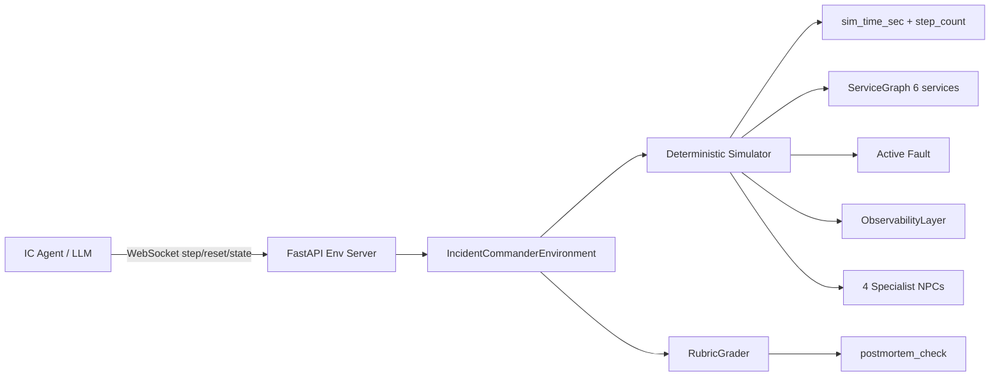
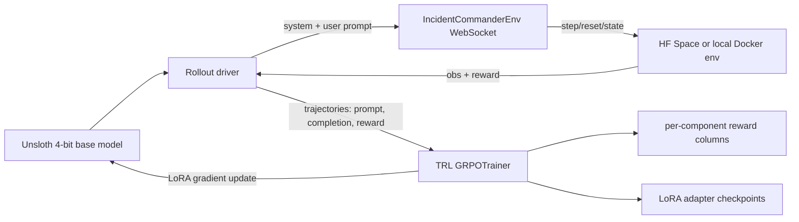

# Incident Commander OpenEnv — Project Brief

> A deterministic, multi-actor, long-horizon OpenEnv environment that puts an
> LLM into the shoes of an on-call Incident Commander during a simulated
> production outage — and an RL training loop that measurably improves a small
> base model against it.

This document is the single source of truth for the project. It explains the
problem, the environment, the agent, the tasks, the reward model, the
post-training strategy, the deployment story, the demo plan, and how every
piece maps to the Hackathon Self-Serve Guide. If you hand this to a teammate
or a judge cold, they should understand the whole project in ~10 minutes.

For the time-phased execution plan, see
[`.cursor/plans/incident_commander_openenv_8deacc01.plan.md`](.cursor/plans/incident_commander_openenv_8deacc01.plan.md).

---

## TL;DR

- **Theme:** Multi-Agent + Long-Horizon (with both sponsor bonuses in scope).
- **Role simulated:** on-call Incident Commander for a 6-service fintech
  microservices product during an outage. The IC queries observability data,
  delegates to four specialist NPCs, picks a mitigation, handles customer
  comms, and writes a post-mortem.
- **Curriculum:** three tasks — easy (canary regression, done),
  medium (third-party attribution, next), hard (silent data corruption, stretch).
- **Reward:** six programmatic components summing to `[0, 1]` — containment,
  MTTR, correct RCA, right mitigation, comms SLA, post-mortem quality. Every
  component is deterministic; `RubricGrader` never calls an LLM.
- **Agent loop:** OpenEnv `reset/step/state` over WebSocket; typed
  Pydantic `ICAction` / `ICObservation`; 11 discrete ops.
- **Training:** TRL + Unsloth + GRPO against a 7B base model on the easy task.
  GRPO is the right fit because our reward is fully verifiable (RLVR).
- **Demo target:** pre-training vs post-training score on easy, with the
  per-component breakdown, on identical seeds.

---

## Table of Contents

1. [Problem Statement](#1-problem-statement)
2. [Environment](#2-environment)
3. [Agent Capabilities](#3-agent-capabilities)
4. [Tasks (Curriculum)](#4-tasks-curriculum)
5. [Reward Model & Evaluation Logic](#5-reward-model--evaluation-logic)
6. [Post-Training / Self-Improvement Strategy](#6-post-training--self-improvement-strategy)
7. [Deployment](#7-deployment)
8. [Evaluation Pipeline](#8-evaluation-pipeline)
9. [Demo Plan](#9-demo-plan)
10. [Execution Timeline](#10-execution-timeline-the-hybrid-48-hour-plan)
11. [Compliance Map to the Self-Serve Guide](#11-compliance-map-to-the-self-serve-guide)
12. [Risks & Safeguards](#12-risks--safeguards)
13. [File Layout](#13-file-layout)
14. [How to Run](#14-how-to-run-quickstart)
15. [Roadmap / Future Work](#15-roadmap--future-work)
16. [Team Roles](#16-team-roles)
17. [References](#17-references)

---

## 1. Problem Statement

Production outages are the single most expensive class of failure in modern
software. An **Incident Commander (IC)** is the person who coordinates the
response: they read dashboards, delegate investigation to specialists (SRE,
Security, Customer Comms, Eng Lead), decide *whether* to mitigate, choose the
*right* mitigation, communicate with customers under time pressure, and
author the post-mortem afterward.

Doing this well requires:

- **Theory of mind** — knowing which specialist to ask what, and when.
- **Attribution reasoning** — is the symptom caused by us, a downstream
  dependency, or a third party?
- **Judgement under uncertainty** — inaction is sometimes the best action.
- **Low-signal detection** — some incidents leave no alert.
- **Clear communication** — status-page updates, exec summaries, post-mortem
  write-ups, each with different audiences.

This project provides a deterministic, sandboxed **OpenEnv environment**
that evaluates those exact competences — and an RL training loop that can
actually move the needle on a small LLM.

### Why this domain clears the rubric bars

- **30% "Real-world task":** SRE incident response is a multi-billion-dollar
  profession (Datadog, PagerDuty, Grafana). The rubric disqualifies
  CartPole-style submissions; this is the opposite.
- **Multi-Agent theme:** four named NPC specialists, each with distinct
  tools, that the agent must delegate to and reason about.
- **Long-Horizon theme:** 30–80 simulated steps, dense-per-step shaping,
  sparse terminal signals (MTTR, blast radius, post-mortem quality).
- **Fleet AI bonus (Scalable Oversight):** the post-mortem grader literally
  checks that the IC can *explain* the NPCs' actions against a ground-truth
  event log.
- **Halluminate bonus (Multi-Actor):** the IC is explicitly the managing
  actor for four co-actors with distinct affordances.
- **Creativity (10%):** three *qualitatively different* reasoning modes —
  deductive (easy), attributional across boundaries (medium), low-signal
  about invisible state (hard). The guide and the rubric both flag that
  qualitative (not just quantitative) task variation is what gets credit.

---

## 2. Environment

### 2.1 Architecture



OpenEnv standardises the client-server boundary. Our server is a FastAPI app
(`server/app.py`) that creates one `IncidentCommanderEnvironment` per
WebSocket session. Each env owns exactly one `Simulator` and one
`RubricGrader`.

### 2.2 Service topology

Six services in a fixed dependency DAG:

```
    api_gw
   /   |   \
 auth  payments  orders
          |        |
       (stripe)  inventory
 notifications (leaf, no deps)
```

Each service has typed baseline health (`latency_p99_ms`, `error_rate`,
`requests_per_sec`) and SLO thresholds. `payments` depends on an external
provider (`stripe`) — the medium task's attribution hinges on this.

### 2.3 Deterministic simulator (critical)

The submission checklist disqualifies non-reproducible graders. Every random
draw in the simulator flows through a single seeded `random.Random` stored on
the `Simulator`. No wall-clock time is read anywhere. NPCs are FSM policies,
not LLM calls. The same action sequence always produces bit-identical
observations and bit-identical rewards.

### 2.4 Observability layer

Pure-function generators driven by (sim state, seeded RNG):

- `render_dashboard()` — always-on per-service health snapshot.
- `render_alerts()` — fires on SLO breach with severity.
- `gather_logs()` — only populates `obs.log_samples` when explicitly queried.
  When a fault is active, logs include fault-specific hints (e.g. the
  canary deploy tag).
- `gather_traces()` — trace spans, one span per op with the offending path
  flagged `error=True`.
- `gather_audit_events()` — mostly empty; lights up for the
  `DataCorruptionFault` (hard task).
- `gather_external_status()` — synthetic third-party status page for
  `ThirdPartyOutageFault` (medium task).

### 2.5 Specialist NPCs

Four deterministic FSM policies:

| Role       | Class       | Strength                                      |
|------------|-------------|-----------------------------------------------|
| `sre`      | `SRENPC`    | Correlates logs, deploys, and dependency chains |
| `security` | `SecurityNPC` | Reads audit feed, flags anomalous actors     |
| `comms`    | `CommsNPC`  | Drafts customer-facing copy, flags SLA risk   |
| `eng_lead` | `EngLeadNPC` | Sizes blast radius, owns the fix plan        |

Each NPC's `respond()` is a pure function of `(task, fault, graph, sim_time_sec)`.
Findings are informative but not trivialising — they never say "call rollback
on payments," they say "the canary deploy is the likely culprit; rollback is
the typical move."

---

## 3. Agent Capabilities

What the agent perceives, what it can do, and what it can't.

### 3.1 Perception — `ICObservation`

Always populated:

- `alerts: list[Alert]` — current firing alerts (id, severity, service, message).
- `dashboard: dict[str, ServiceHealth]` — per-service latency / error /
  traffic / healthy.
- `sim_time_sec: int` — simulated wall-clock since reset.
- `blast_radius_pct: float` — max observed blast radius this episode, in [0,1].
- `revenue_loss_usd: float` — cumulative incident revenue impact.
- `step_budget_remaining: int` — steps left before forced termination.
- `last_action_result: str` — short human-readable result of the last op.
- `task_id: str` — which scenario is running.

Populated only when queried (keeps the observation compact and makes
information-gathering a real opportunity cost):

- `log_samples: list[LogLine]`
- `trace_spans: list[Span]`
- `audit_events: list[AuditEvent]`
- `external_status: ExternalStatusReport | None`

Accumulated across the episode:

- `npc_reports: list[NPCReport]` — every delegation's result.
- `chat_feed: list[ChatMessage]` — every `communicate` the IC has sent.

### 3.2 Actions — `ICAction` (flat union of 11 `op` kinds)

| Op | Purpose | Cost |
|---|---|---|
| `query_logs` | Pull a window of synthetic logs for a service | 1 step |
| `query_metrics` | Detailed metric snapshot for a service | 1 step |
| `query_trace` | Trace spans for a service or trace id | 1 step |
| `query_audit` | Audit-log events (usually empty) | 1 step |
| `query_external_status` | Synthetic third-party provider status | 1 step |
| `delegate` | Delegate to `sre` / `security` / `comms` / `eng_lead` | 1 step |
| `mitigate` | `restart` / `rollback` / `partial_rollback` / `scale` / `feature_flag` / `hold` | 1 step |
| `communicate` | Send on `status_page` / `customer_email` / `exec_update` | 1 step |
| `diagnose` | Submit hypothesis `{service, root_cause_tag}` | 1 step, graded |
| `resolve` | Mark incident resolved | 1 step |
| `postmortem` | Submit final JSON post-mortem — terminates episode | 1 step, graded |

**Crucial design choice:** `hold` is a first-class mitigation. The medium
task rewards picking it when the root cause is external. This lets the env
test a real IC competence — knowing when **not** to act — that binary-action
benchmarks don't.

### 3.3 Limits & guards

- Step budget: 80 steps max (tunable per task).
- Invalid ops burn a step (via `Simulator.advance_with_noop`) — no free retry.
- Episode terminates on `postmortem` or budget exhaustion.
- All sim randomness through one seeded `random.Random`; identical runs are
  bit-identical.

---

## 4. Tasks (Curriculum)

Per guide Section 6, make success possible early. The three tasks exercise
qualitatively different reasoning modes — not just "harder versions of the
same thing."

### 4.1 Easy — `easy_canary_regression` (done)

- **Scenario:** A fresh canary deploy on `payments` at 5% traffic is showing
  2× the control group's error rate. Dashboard signal is loud and unambiguous.
- **Reasoning mode:** deductive — one-hop symptom → cause.
- **Correct path:** `query_metrics(payments)` → `delegate(sre)` →
  `diagnose(payments, bad_deploy)` → `mitigate(rollback, payments)` →
  `communicate(status_page, ...)` → `postmortem(...)`.
- **Target baseline:** ≥ 0.6 (rubric floor).
- **Oracle ceiling (scripted ideal play):** 0.872 — validated in-process and
  through HTTP/Docker.

### 4.2 Medium — `medium_third_party_attribution` (next)

- **Scenario:** Payment-webhook ingestion is failing. Is it us, our
  integration, or Stripe?
- **Three variants** (picked per episode seed):
  1. Provider-side outage — ground-truth mitigation: `hold` + communicate.
  2. Our integration bug — ground-truth mitigation: `feature_flag` to a
     backup processor.
  3. Our recent deploy — ground-truth mitigation: `rollback`.
- **Reasoning mode:** attribution across system boundaries. Inaction is
  sometimes the right answer.
- **Target baseline:** 0.3–0.6 (≥0.15 gap below easy).
- **Qualitative jump:** reward is maximised by *not* mitigating when the root
  cause is external. No task-1 policy reflex survives.

### 4.3 Hard — `hard_silent_data_corruption` (stretch)

- **Scenario:** A customer reports wrong account balances after a recent
  database migration. Zero alerts firing. Dashboards green.
- **Reasoning mode:** low-signal, reasoning about invisible state.
- **Correct path:** `query_audit(orders)` → correlate anomalous writes to
  deploy timeline → `delegate(eng_lead)` to size the affected cohort →
  `mitigate(partial_rollback, orders)` → `communicate(customer_email,
  cohort=affected_cohort, ...)` → `postmortem(...)`.
- **Target baseline:** < 0.8 (rubric's hard-task ceiling).
- **Qualitative jump:** no surface signal; the IC must *seek* evidence the
  dashboards don't show.

---

## 5. Reward Model & Evaluation Logic

Every task uses the same `RubricGrader` with the same six components summing
to 1.0. Per-task tuning knobs (`target_mttr_sec`, `comms_sla_sec`,
`max_blast_radius`) live on `TaskConfig`.

### 5.1 The six components

| Component | Weight | Signal kind | Description |
|---|---:|---|---|
| **Containment** | 0.25 | Terminal | `1 − min(1, max_blast_radius_pct / task_max)` |
| **MTTR** | 0.20 | Terminal | `exp(−elapsed / target_mttr_sec)`; for `hold`-correct tasks this is replaced by time-to-correct-attribution |
| **Correct RCA** | 0.20 | Per-step | `diagnose` against ground-truth service + tag; **partial 0.5** for service-only match, **1.0** for service + tag |
| **Right mitigation** | 0.15 | Per-step | Exact match to ground-truth mitigation + target; **`hold` credits only when ground-truth is `hold`** |
| **Comms SLA** | 0.10 | Per-step | First `status_page` update within `comms_sla_sec` of fault start; spam cooldown |
| **Post-mortem quality** | 0.10 | Terminal | Programmatic JSON check — summary, root_cause_service, root_cause_tag, timeline ≥ 2 entries, actions_taken ≥ 1 entry |

### 5.2 Dense vs terminal signal

Guide Section 9 emphasises process-aware feedback. Our signal is dense enough
that an RL agent doesn't have to solve the whole task to see any reward:

- Diagnose correctly → 0.20 immediate.
- Mitigate correctly → 0.15 immediate.
- Post `status_page` within SLA → 0.10 immediate.
- Containment, MTTR, and post-mortem are added at terminal.

That's at least three mid-episode reward events, which clears the rubric's
"at least 3 distinct reward levels across the trajectory" rule and gives
GRPO a shaped signal to learn against.

### 5.3 Anti-gaming guards

| Exploit | Guard |
|---|---|
| Spam `diagnose` until guess right | Only the best partial-credit score across the episode counts |
| Pick `hold` unconditionally | `hold` credits mitigation **only** when ground-truth is `hold` |
| Spam `status_page` updates | 60-second cooldown; a second update too soon zeroes the comms component |
| Submit post-mortem first and skip | Post-mortem factuality is checked against the fault's ground-truth service+tag, which requires a real `diagnose` to know |
| Wrong mitigation followed by right one | Only the first correctly-matched mitigation credits; destructive mitigations never credit |
| Send garbage JSON | Env-level validation catches it; the step burns budget and grader never sees it |
| Hack the clock | No wall-clock is read; sim time is a pure counter on `Simulator` |

### 5.4 Verifiable, deterministic, partial credit

Matches the submission checklist point-by-point:

- **Programmatic** — `RubricGrader` is ~250 lines of Python; no LLM call.
- **Deterministic** — pure function of simulator state; replay is
  bit-identical (verified in smoke tests).
- **Partial credit** — every component except the RCA service-only fallback
  is continuous; no binary graders on medium/hard tasks.
- **Bounded** — each component clamped to its weight; total clamped to 1.0.
- **Reproducible** — no system time, no external APIs, no un-seeded randomness.

### 5.5 Worked examples (validated end-to-end)

These are real numbers from our smoke tests:

| Policy | Score | Components earned |
|---|---:|---|
| Ideal play | **0.872** | All six components land, MTTR decay ~0.13 |
| Late mitigation (10 wasted steps) | 0.717 | MTTR decay visible |
| Partial diagnose (right service, wrong tag) | 0.798 | RCA worth 0.10 instead of 0.20 |
| Wrong mitigation (`restart`) | 0.500 | Mitigation 0; no MTTR; post-mortem schema-only |
| No-op (only queries) | 0.138 | Containment partial only |
| Deterministic replay | identical | 0.871564 == 0.871564 |

The curve is exactly what GRPO wants: cheap/random policies sit around
0.1–0.2, competent policies at 0.7–0.9, and the gradient pulls upward.

---

## 6. Post-Training / Self-Improvement Strategy

This is where the hackathon self-serve guide puts most of its emphasis
(Sections 2, 3, 10, 11, 15, 16). The submission rubric scores the env; the
guide + Section 19 "compelling demo" checklist scores the story, and the
story needs training evidence.

### 6.1 Method — RL with verifiable rewards (RLVR) via GRPO

Guide Section 11 explicitly recommends GRPO for verifiable-reward settings.
GRPO drops PPO's value-head requirement, which is the single biggest win
for 7B-scale training on one GPU.

Our rubric is **fully programmatic and deterministic** — no learned reward
model, no LLM-as-judge, no RLHF pair-ranking. That's the canonical RLVR
setup the guide is designed for.

### 6.2 Training stack



Three libraries, three responsibilities:

- **OpenEnv** (done) — environment interface, HTTP/WebSocket server,
  deterministic simulator.
- **Unsloth** — fast 4-bit LoRA base model; ~2× rollout speedup vs vanilla
  `transformers.generate`, which matters because guide Section 12 notes
  rollouts dominate RL wall-time.
- **TRL** — `GRPOTrainer` consumes our rollouts and updates the LoRA.

### 6.3 Base model choice — why Qwen2.5-7B-Instruct

- Strong JSON-output behaviour with light system-prompt priming (our action
  space is a discriminated-union Pydantic model; structured output
  reliability matters a lot).
- Unsloth ships a ready-made 4-bit `unsloth/Qwen2.5-7B-Instruct` variant.
- 7B in 4-bit + LoRA fits in 24 GB VRAM comfortably for GRPO rollouts + updates.
- Fallback: `unsloth/Llama-3.2-3B-Instruct` if only 12-16 GB is available.

### 6.4 Curriculum — train on easy, eval on all

Guide Section 6 is explicit: make success possible early. The canary-regression
easy task is where a 7B model can actually see non-zero reward under a thin
system prompt. Training on easy gives us:

- A measurable pre/post comparison on easy (the headline demo artifact).
- A generalisation check on medium — does the agent improve there too?
- A negative-transfer check on the (stretch) hard task — does it over-generalise?

If training saturates early on easy, we expand to mixed-task sampling as a
stretch. We explicitly do *not* train on medium/hard first; the guide warns
that zero-reward-probability kills the loop.

### 6.5 Rollout driver

The `training/rollout.py` module is the only piece of training code that
touches the env. Responsibilities:

1. Spin up a fresh WebSocket session per episode.
2. Render observations via the **same** `render_observation()` helper that
   `inference.py` uses — single source of truth.
3. Call the base model via Unsloth's fast generate (temperature 0.7,
   top_p 0.95 during training; temperature 0.1 at eval).
4. Parse JSON → `ICAction` via the **same** `dict_to_action()` helper.
5. Collect `(prompt, completion, reward, per_component_rewards, done)` per step.
6. Terminate on `done=True` or `max_steps=25`.
7. Return the full trajectory to `GRPOTrainer`.

### 6.6 Reward hacking countermeasures

Guide Section 8 lists this as the single biggest RL failure mode. Our pre-
and in-loop defences:

**Pre-emptive (baked into the rubric, Section 5.3):** anti-gaming guards
against the seven obvious exploits.

**In-loop:**

- **Per-component metric columns.** GRPO gets the scalar `total`, but the
  trainer also logs containment / MTTR / RCA / mitigation / comms /
  post-mortem separately. If the total goes up while (say) the mitigation
  component goes down, that's a red flag — we stop and inspect.
- **Periodic generation sampling.** At 3 checkpoints we sample 20 full
  episodes and hand-read them. Looking for:
  - Repeated identical actions.
  - Diagnose spam.
  - Ignored context (agent ignores NPC reports).
  - Post-mortem hallucination (made-up timeline entries).
- **Regression gate.** Any checkpoint where any of {RCA, mitigation,
  post-mortem} is not-higher than the pre-training baseline is rejected
  even if total is higher.

### 6.7 Save path (guide Section 16)

Unsloth's **merged-save path** only. The guide explicitly warns that the
naive 4-bit → 16-bit upcast + LoRA merge damages model quality. We'll either:

- Ship LoRA adapters + a loader snippet (cheapest, most transparent), or
- Produce a `merged_16bit` checkpoint via
  `model.save_pretrained_merged(..., save_method="merged_16bit")`.

We test post-training inference immediately after saving — never leave
export until the last hour.

### 6.8 Monitoring (guide Section 15)

Dashboards track:

- Overall reward (mean + std over a rolling window).
- Each of the six component columns (absolute + delta from baseline).
- Episodes where `done=True` was reached via `postmortem` vs step-budget.
- Per-op call frequency (for exploit detection — sudden spikes in a single
  op class = suspicious).
- Wall-clock per rollout (inference-speed tracking).

### 6.9 Expected outcomes

Rough ranges we'd expect on the easy task:

| Model | Score |
|---|---:|
| Qwen2.5-7B-Instruct (pre-training baseline) | ~0.3–0.5 |
| Qwen2.5-7B-Instruct + GRPO (post-training) | ~0.6–0.8 |
| Qwen2.5-72B-Instruct (frontier baseline) | ~0.6–0.8 |
| Scripted oracle (ceiling) | 0.872 |

Target delta on easy: **+0.2 absolute** (pre → post). That's the demo
headline.

### 6.10 Fallback — best-of-N reward-guided sampling

If no GPU is reachable in the training window (R7 in the plan), we pivot
to a best-of-N demo:

- For each observation, sample N=8 completions from Qwen-72B at temperature=0.9.
- Score each rollout's total episode reward against the rubric.
- Pick the max-reward completion as the "post-training" behaviour.

This still exercises the verifier, shows measurable improvement, and is
explicit in the README that it's a reward-guided inference-time strategy,
not trained weights. The guide's Section 2 framing — "RL as an efficient
version of repeated in-context improvement" — covers exactly this pattern.

---

## 7. Deployment

### 7.1 Local

```bash
cd incident_commander
openenv build
docker run -d -e IC_TASK_ID=easy_canary_regression -p 8000:8000 \
  openenv-incident_commander:latest
```

Or without Docker:

```bash
cd incident_commander
IC_TASK_ID=easy_canary_regression uvicorn server.app:app \
  --host 0.0.0.0 --port 8000
```

### 7.2 Hugging Face Space

Scheduled for H26–H28 of the plan (pulled forward from H40, per guide
Section 13). Once up:

```bash
cd incident_commander
openenv validate
openenv push --repo-id your-user/incident-commander-env
```

The Space is public, tagged `openenv`, Docker-type.

### 7.3 Environment variables

| Variable | Default | Used by |
|---|---|---|
| `IC_TASK_ID` | `easy_canary_regression` | Server factory, selects the scenario |
| `IC_SEED` | `0` | Server factory, seeds the simulator |
| `IC_STEP_BUDGET` | (per-task default) | Optional override |
| `API_BASE_URL` | `https://router.huggingface.co/v1` | `inference.py`, OpenAI client |
| `MODEL_NAME` | unset | `inference.py` |
| `HF_TOKEN` | unset | `inference.py`; must have **"Make calls to Inference Providers"** scope |
| `ENV_URL` | `http://localhost:8000` | `inference.py`, env server to talk to |
| `MY_ENV_TASK` | (falls back to `IC_TASK_ID`) | `inference.py` |
| `MAX_STEPS` | 25 | `inference.py` |
| `IC_MOCK_POLICY` | unset | `inference.py`, 1 = use scripted oracle (no API key needed) |

---

## 8. Evaluation Pipeline

### 8.1 `inference.py`

Located at `incident_commander/inference.py` (the project root per the
checklist). Contract:

- Uses the `openai` client **only**. No `requests`, no `httpx`, no
  `anthropic` SDK, no `transformers` pipeline for LLM calls.
- Reads all config from env vars; auto-loads `.env` via `load_dotenv`
  (`override=True` so file values beat empty shell exports).
- Emits exactly one `[START]`, one `[STEP]` per env step, exactly one
  `[END]` — always, even on exception (wrapped in `finally`).
- `reward` and `rewards[i]` formatted to exactly 2 decimals.
- `score` formatted to exactly 3 decimals.
- `done` and `success` lowercase `true` / `false`.
- `error` either the error string or literal `null`.

Verified with the checklist's own regex validator (Section 11 of the
submission checklist).

### 8.2 Example run (mock oracle through Docker)

```
[START] task=easy_canary_regression env=incident_commander model=mock:oracle
[STEP] step=1 action=query_metrics[svc=payments] reward=0.00 done=false error=null
[STEP] step=2 action=delegate[role=sre] reward=0.00 done=false error=null
[STEP] step=3 action=communicate[ch=status_page] reward=0.10 done=false error=null
[STEP] step=4 action=diagnose[rc=payments:bad_deploy] reward=0.20 done=false error=null
[STEP] step=5 action=mitigate[mit=rollback,target=payments] reward=0.15 done=false error=null
[STEP] step=6 action=postmortem reward=0.42 done=true error=null
[END] success=true steps=6 score=0.872 rewards=0.00,0.00,0.10,0.20,0.15,0.42
```

### 8.3 Baseline matrix (to be filled as the schedule lands each row)

| Task | Model | Mode | Seeds | Mean score | ± std | Notes |
|---|---|---|---:|---:|---:|---|
| easy | scripted oracle | ceiling | 3 | 0.872 | ±0.00 | Validated |
| easy | Qwen2.5-72B-Instruct | pre-training baseline | 3 | TBD | TBD | Gated on user token |
| easy | Llama-3.3-70B-Instruct | pre-training baseline | 3 | TBD | TBD | Gated on user token |
| easy | Qwen2.5-7B-Instruct | pre-training baseline | 3 | TBD | TBD | Training base |
| easy | Qwen2.5-7B-Instruct + GRPO | post-training | 3 | TBD | TBD | **Headline delta** |
| medium | Qwen2.5-72B-Instruct | pre-training baseline | 3 | TBD | TBD | After task impl |
| medium | Qwen2.5-7B-Instruct + GRPO | post-training (generalisation) | 3 | TBD | TBD | Shows transfer |
| hard | Qwen2.5-72B-Instruct | pre-training baseline | 3 | TBD | TBD | Stretch |

---

## 9. Demo Plan

Shape follows guide Section 19's compelling-demo template exactly:

1. **Baseline attempt.** Run `inference.py` with the **pre-training**
   7B model against the easy task on a fixed seed. Show the `[START]/[STEP]/[END]`
   log, the rubric component breakdown, and the total score (e.g. 0.42).
2. **Rubric breakdown on screen.** Show which components the baseline missed
   (probably mitigation, comms, post-mortem quality) vs which it caught
   (probably containment partial credit from blast-radius containment).
3. **Trained-model attempt.** Same seed, same inference.py, swap the model to
   the post-training LoRA-merged checkpoint. Show the new run: higher reward
   on earlier steps, different action shape, higher terminal score (target ≥ 0.65).
4. **Measurable improvement.** Absolute delta, per-component deltas, std
   across 3 seeds.
5. **Safeguards explanation.** 30-second bullet list: six independent reward
   components, anti-gaming guards, deterministic replay, per-component
   monitoring during training, Unsloth merged-save path.

If the training path is on the fallback (best-of-N), swap step 3 for
"reward-guided best-of-N sampling from the 72B baseline" and be explicit
about it in the script.

---

## 10. Execution Timeline (the hybrid 48-hour plan)

Phase-level. Full detail + risks in
[`incident_commander_openenv_8deacc01.plan.md`](.cursor/plans/incident_commander_openenv_8deacc01.plan.md).

| Phase | Hours | Status | Key artifacts |
|---|---:|---|---|
| Scaffold | H0–H4 | ✅ done | `openenv init`; typed models; stub env; Docker builds |
| Simulator core | H4–H12 | ✅ done | `simulator/` package; canary fault; 4 NPCs |
| Easy task + grader + `inference.py` | H12–H20 | ✅ done | `graders/`; mock oracle 0.872 via HTTP |
| Medium task | H20–H26 | ⏳ next | Flesh out `ThirdPartyOutageFault`, 3 variants |
| HF Space early deploy | H26–H28 | ⏳ | Per guide Section 13 |
| Training stack (TRL + Unsloth + GRPO) | H28–H36 | ⏳ | `training/` package, pre-training baseline locked |
| Training tuning + anti-hack audit | H36–H40 | ⏳ | Post-training baseline, LoRA saved correctly |
| Hard task (stretch) | H40–H42 | ⏳ stretch | Only if training lands early |
| Polish + final deploy | H42–H46 | ⏳ | Docker slim, README, openenv.yaml, re-push |
| Demo prep | H46–H48 | ⏳ | Before/after recordings, pitch |

---

## 11. Compliance Map to the Self-Serve Guide

| Guide § | Topic | Status | Evidence |
|---:|---|---|---|
| 0 | Env → rewards → TRL → Unsloth → deploy stack | On track | Env + rewards done; training planned H28–H40; deploy H26 + H44 |
| 1 | Task has step-by-step action / verifiable / winnable | ✅ Full | 11 discrete ops; `RubricGrader` is programmatic; oracle scores 0.872 |
| 2 | Minimum RL loop | ✅ Env side | Loop closes end-to-end; weight updates land H28+ |
| 3 | SFT vs RL warm start | ✅ Decided | Start from Qwen2.5-7B-Instruct; no SFT pass (base has enough to hit non-zero reward under prompt priming) |
| 4 | Env is a first-class artifact | ✅ Full | Typed Pydantic models, `reset/step/state`, six reward components, budget + abuse guards |
| 5 | Build with OpenEnv | ✅ Full | `openenv init` used, FastAPI wrapper, factory for session task selection, container built and running |
| 6 | Keep task simple first (curriculum) | ✅ Full | Easy done; training targets easy only; medium/hard for eval-only |
| 7 | Multiple independent reward functions | ✅ Full | Six components (containment, MTTR, RCA, mitigation, comms, post-mortem) |
| 8 | Protect against reward hacking | ✅ Full | Seven anti-gaming guards baked in; per-component monitoring planned |
| 9 | Process-aware feedback | ✅ Partial | Per-step rewards on RCA, mitigation, comms; no LLM-as-judge |
| 10 | TRL + Unsloth + OpenEnv | On track | OpenEnv done; TRL + Unsloth in H28–H36 |
| 11 | GRPO / RLVR | ✅ Planned | Fully-programmatic rubric → RLVR; GRPO over PPO for 7B-on-one-GPU fit |
| 12 | Keep inference fast | ✅ Env side | Pure-Python sim, no LLM inside env; Unsloth fast-path for rollouts |
| 13 | Deploy env early | On track (pulled forward) | Originally H40, now H26–H28 |
| 14 | Scale only after stable | ✅ Full | All 9 scaffold + sim + grader checks passed before any training |
| 15 | Monitor reward + columns + generations | ✅ Planned | Per-component columns logged; 20-generation samples at 3 checkpoints |
| 16 | Save LoRA / QLoRA correctly | ✅ Planned | Unsloth merged-save path only; immediate post-save inference test |
| 17 | Team split | Solo; fills the four roles sequentially | See §16 |
| 18 | 1-day execution plan phases | Phases 1–3 ✅; 4–9 scheduled | See §10 |
| 19 | Compelling judge content | On track | Env design ✅, objective rewards ✅, anti-hacking ✅; training evidence + deploy + demo in scope |
| 21 | Common mistakes | Avoided 7/7 so far | Task winnable; 6 rewards; designed against hacking; stability before scale; per-component inspection; step budget; save path planned |

---

## 12. Risks & Safeguards

Kept in sync with [§7 of the plan](.cursor/plans/incident_commander_openenv_8deacc01.plan.md#7-risks-and-mitigations):

- **R1 Non-determinism.** Single seeded `random.Random`, no wall-clock, no
  external APIs, replay-determinism assertion in smoke tests.
- **R2 Hard task calibration.** Stretch-only; tune against a cheap baseline
  if the slot opens.
- **R3 Trivial `hold` exploit.** `hold` credits mitigation only when
  ground-truth mitigation is `hold`.
- **R4 Docker image > 1 GB.** Currently 1.36 GB on `openenv-base`.
  Addressed in H42–H46 with `python:3.11-slim` base.
- **R5 Scope creep.** Hard freeze at H28; cut-list ordered by impact.
- **R6 GRPO doesn't converge / reward hacks.** Time-boxed window,
  3-checkpoint generation audits, per-component gate, best-of-N fallback.
- **R7 GPU unavailable.** Pre-verify CUDA + 16 GB at H26; fallback to
  `Llama-3.2-3B` (12 GB) or best-of-N.
- **R8 Silent reward hack.** Per-component monitoring + regression gate
  rejecting any checkpoint where RCA/mitigation/post-mortem didn't improve.
- **R9 Training loop contends with the Space.** Training hits
  `localhost:8000` only; Space is reserved for the demo + reproducibility.

---

## 13. File Layout

Current state of the repo:

```
OpenEnv/                                         # workspace root
├── .env                                         # local HF_TOKEN etc (gitignored)
├── .gitignore                                   # excludes .env, __pycache__, .venv/, egg-info
├── .venv/                                       # Python 3.11 venv (gitignored)
├── PROJECT.md                                   # ← this document
├── .cursor/plans/
│   └── incident_commander_openenv_8deacc01.plan.md   # time-phased execution plan
└── incident_commander/                          # the OpenEnv environment (project root per checklist)
    ├── __init__.py                              # exports ICAction, ICObservation, IncidentCommanderEnv
    ├── models.py                                # typed Pydantic action/observation + nested value types
    ├── client.py                                # WebSocket EnvClient subclass
    ├── inference.py                             # baseline inference script (OpenAI client, exact log format)
    ├── openenv.yaml                             # spec file (to be expanded with tasks block in polish phase)
    ├── pyproject.toml                           # declares all three subpackages + python-dotenv dep
    ├── README.md                                # HF Space header + rubric sections (to be expanded)
    ├── uv.lock
    ├── simulator/
    │   ├── __init__.py
    │   ├── service_graph.py                     # 6-service topology + baseline health
    │   ├── faults.py                            # Fault ABC + 3 concrete types
    │   ├── observability.py                     # deterministic synthetic telemetry
    │   ├── npcs.py                              # 4 specialist FSMs
    │   └── simulator.py                         # top-level aggregator, 3 TaskConfig entries
    ├── graders/
    │   ├── __init__.py
    │   ├── rubric.py                            # six-component weighted grader
    │   └── postmortem_check.py                  # programmatic post-mortem schema + GT check
    └── server/
        ├── __init__.py
        ├── app.py                               # create_app factory with IC_TASK_ID / IC_SEED env vars
        ├── incident_commander_environment.py    # thin OpenEnv adapter; wires RubricGrader
        ├── Dockerfile                           # multi-stage, openenv-base
        └── requirements.txt                     # minimal container deps
```

Planned additions in upcoming phases:

```
incident_commander/
├── Dockerfile                                   # root-level mirror (checklist §6.1 requirement)
├── requirements.txt                             # root-level pinned deps
├── training/                                    # ← H28 onward
│   ├── __init__.py
│   ├── config.py                                # base model, hyperparams, task, checkpoint dir
│   ├── rollout.py                               # driver: prompt → env → trajectory
│   ├── train.py                                 # TRL GRPOTrainer wiring
│   └── eval.py                                  # pre/post baseline harness
└── tests/
    └── test_smoke.py                            # reset + step + determinism + grader ceiling
```

---

## 14. How to Run (Quickstart)

### 14.1 One-time setup

```bash
cd /path/to/OpenEnv
uv venv --python 3.11 .venv
source .venv/bin/activate
cd incident_commander
uv pip install -e .
openenv build                                   # build local Docker image
```

### 14.2 Run the env server (three options)

Local Docker (matches HF Space):

```bash
docker run -d --name ic -e IC_TASK_ID=easy_canary_regression \
  -p 8000:8000 openenv-incident_commander:latest
```

Local Python (hot-reload friendly):

```bash
cd incident_commander
IC_TASK_ID=easy_canary_regression \
  uvicorn server.app:app --host 0.0.0.0 --port 8000
```

Remote HF Space (once pushed):

```bash
# inference.py points at ENV_URL, set that to your Space URL
export ENV_URL=https://your-user-incident-commander.hf.space
```

### 14.3 Dry-run inference (no API key needed)

```bash
cd incident_commander
IC_MOCK_POLICY=1 python inference.py
# should emit [START] → [STEP]×6 → [END] with score=0.872
```

### 14.4 Real LLM baseline

1. Put a valid HF token with "Make calls to Inference Providers" scope in
   the workspace `.env`:

   ```
   HF_TOKEN=hf_...
   API_BASE_URL=https://router.huggingface.co/v1
   MODEL_NAME=Qwen/Qwen2.5-72B-Instruct
   ```

2. Verify the token with curl before committing to a full run:

   ```bash
   curl -sS -X POST "$API_BASE_URL/chat/completions" \
     -H "Authorization: Bearer $HF_TOKEN" \
     -H "Content-Type: application/json" \
     -d '{"model":"'"$MODEL_NAME"'","messages":[{"role":"user","content":"hi"}],"max_tokens":5}'
   ```

3. Run:

   ```bash
   cd incident_commander
   python inference.py
   ```

### 14.5 Train (after H28)

```bash
cd incident_commander
# pre-training baseline: record the score we aim to beat
python -m training.eval --model unsloth/Qwen2.5-7B-Instruct --task easy_canary_regression --seeds 3

# train
python -m training.train --task easy_canary_regression --steps 1500

# post-training evaluation
python -m training.eval --adapters ./checkpoints/latest --task easy_canary_regression --seeds 3
```

---

## 15. Roadmap / Future Work

Not in the 48-hour window; tracked for later.

- **Richer multi-actor behaviour** — NPC refusal on under-specified
  delegations; adversarial scripted actor on a future credential-compromise
  task; NPC-to-NPC disagreement.
- **Dual-mode NPCs** — `scripted` (deterministic eval) vs `llm` (richer
  training). Mirrors OpenEnv's simulation-vs-production split.
- **More tasks** — `retry-storm`, `compromised-credential`,
  `multi-region-failover`.
- **Curriculum training** — mix easy/medium/hard sampling once the easy
  trained model saturates.
- **Process-supervised rewards** — step-level verifiers distinguishing
  "queried logs before diagnosing" from "diagnosed blindly."
- **HTML timeline viewer** — live rendering of the last episode for demos.
- **SFT warm-start** — if a future task has such sparse reward that the
  base model can never succeed, add a light SFT pass before RL (guide §3).

---

## 16. Team Roles

Solo/pair 48-hour scope. The four guide-Section-17 roles are filled
sequentially by the same builder, with explicit handoffs:

| Role | Artifacts | Current status |
|---|---|---|
| **Environment** | `models.py`, `simulator/`, `server/`, Docker build | ✅ done |
| **Verifier / Rewards** | `graders/rubric.py`, `graders/postmortem_check.py`, anti-gaming guards | ✅ done |
| **Training** | `training/rollout.py`, `training/train.py`, monitoring, save path | ⏳ H28–H40 |
| **Demo / Product** | HF Space, README, baseline tables, recorded episodes | ⏳ H42–H48 |

If a second person is available, the natural split is (Env + Verifier) ↔
(Training + Demo) — the two halves only touch at the `inference.py` /
`render_observation` / `IncidentCommanderEnv` interfaces, all of which are
already stable.

---

## 17. References

- **OpenEnv docs** — https://meta-pytorch.org/OpenEnv/
- **OpenEnv GitHub** — https://github.com/meta-pytorch/OpenEnv
- **Hackathon submission checklist** —
  https://huggingface.co/inmodel/open-env/raw/f44f429e89b50250e74b985717bb20dd4063b5a6/OPENENV_SUBMISSION_CHECKLIST.md
- **TRL GRPO** — https://huggingface.co/docs/trl/main/en/grpo_trainer
- **Unsloth** — https://github.com/unslothai/unsloth
- **Google SRE book** — https://sre.google/sre-book/table-of-contents/ (IC
  framework, MTTR/RCA definitions).
- **PagerDuty IC docs** — https://response.pagerduty.com/training/incident_commander/
- **Real post-mortems this env is modelled on:**
  - Cloudflare 2022 outage — https://blog.cloudflare.com/cloudflare-outage-on-june-21-2022/
  - GitHub 2020 outage — https://github.blog/2020-10-21-actions-workflow-run-delays-incident/
