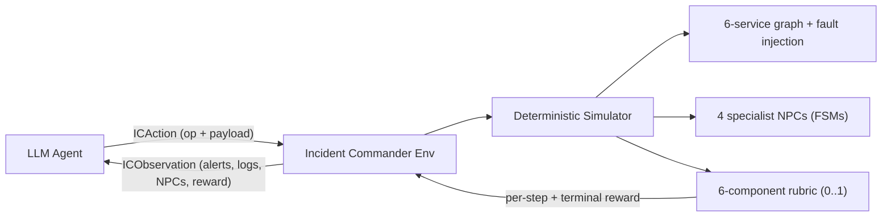

# Incident Commander OpenEnv — Technical Documentation

This is the canonical technical reference for the Incident Commander OpenEnv submission. For the **story** of *why* we built this and *how* we got to a working trained adapter through five attempts (two wins, three regressions), see **[`README.md`](README.md)**.

This document covers:

- [Architecture overview](#architecture-overview)
- [Configuration](#configuration-env-vars)
- [Tasks](#tasks)
- [Action space (`ICAction`)](#action-space-icaction)
- [Observation space (`ICObservation`)](#observation-space-icobservation)
- [Reward rubric & anti-gaming guards](#reward-rubric--anti-gaming-guards)
- [Training results — plots and numbers](#training-results--plots-and-numbers)
- [Full benchmark numbers](#full-benchmark-numbers)
- [Reproduce the training run](#reproduce-the-training-run)
- [Build & run](#build--run)
- [Python client](#python-client)
- [Project layout](#project-layout)

---

## Architecture overview



**Determinism contract.** All random draws flow through one seeded `random.Random` stored on the simulator. No wall-clock time is read anywhere in the sim. NPCs are deterministic FSMs, never LLM calls. The same action sequence produces bit-identical observations and bit-identical rewards — replay asserts this in smoke tests.

**Single-session-per-process.** The OpenEnv server is configured with `max_concurrent_envs=1` and reads `IC_TASK_ID` / `IC_SEED` / `IC_STEP_BUDGET` at session creation. To evaluate a different task, run a separate container/process — not a second session against the same one.

## Configuration (env vars)

Read at **session creation** (each WebSocket client gets a fresh env):

| Variable | Default | Purpose |
| --- | --- | --- |
| `IC_TASK_ID` | `easy_canary_regression` | Which task / fault template |
| `IC_SEED` | `0` | RNG + medium-task variant selection |
| `IC_STEP_BUDGET` | (task default) | Max steps before forced termination |

**Medium task variants** (deterministic from seed): `IC_TASK_ID=medium_third_party_attribution` with seeds `0` / `1` / `2` → provider outage, bad integration, our deploy — smoke-test all three in separate containers or sessions.

## Tasks

| `IC_TASK_ID` | Cognitive ability tested | Right mitigation | Right comms |
| --- | --- | --- | --- |
| `easy_canary_regression` | **Reactive deduction** ("read what's in front of you") | `rollback` | `status_page` |
| `medium_third_party_attribution` | **Discriminative attribution** ("tell apart things that look alike") — variant by `IC_SEED` mod 3 | `hold` / `feature_flag` / `rollback` | `status_page` |
| `hard_silent_data_corruption` | **Inverted reasoning under no signal** ("act when nothing tells you to") | `partial_rollback` | `customer_email` + cohort |

The same scripted oracle scores **0.872 / 0.468 / 0.239** across the three tasks — concrete evidence the env doesn't reward repetition of one trick.

## Action space (`ICAction`)

Flat union: required **`op`** plus optional payload fields (only those relevant to `op`).

| `op` | Role |
| --- | --- |
| `query_logs`, `query_metrics`, `query_trace` | Observability pulls (scoped by `service` where applicable) |
| `query_audit` | Audit log slice |
| `query_external_status` | Third-party / provider status page |
| `delegate` | Request work from a specialist (`specialist`: sre / security / comms / eng_lead) |
| `mitigate` | Execute mitigation (`mitigation`, `target` / `service` as needed) |
| `communicate` | Stakeholder update (`channel`, `message`, optional `audience`) |
| `diagnose` | Submit RCA hypothesis (`service`, `root_cause_tag`) |
| `resolve` | Declare incident resolved |
| `postmortem` | Terminal structured JSON (`postmortem_json`) |

**Mitigation kinds:** `restart`, `rollback`, `partial_rollback`, `scale`, `feature_flag`, `hold`.

Wire schema: `models.py` or **`GET /schema`** on the running server.

## Observation space (`ICObservation`)

Each step returns a rich observation including:

- Simulator time, step index, task id, high-level **service health** and **alerts**
- Results of the **last query** (logs, traces, audit, external status) when applicable — query-scoped fields are populated **only** when the matching `query_*` op was called this step (information-gathering has a real step cost)
- **NPC messages** and latest specialist **reports**
- **Comms** state (e.g. status page last update)
- **`done`**, **`reward`** (incremental rubric signal this step), optional status text

## Reward rubric & anti-gaming guards

Six **independent** weighted components (dense per-step + terminal), all clamped to **[0, 1]** for the episode total:

| Component | Weight | Intent |
| --- | ---: | --- |
| Containment | 0.25 | Limit blast radius / premature bad mitigations |
| MTTR | 0.20 | Time from fault to correct mitigation |
| Correct RCA | 0.20 | `diagnose` vs ground truth (partial credit for service-only) |
| Right mitigation | 0.15 | Correct `mitigate` for this task (`hold` and `partial_rollback` rewarded only when ground truth) |
| Comms SLA | 0.10 | Timely comms; **task-conditional channel** — `status_page` on easy/medium, `customer_email`+cohort on hard |
| Post-mortem | 0.10 | Validated JSON structure + factual fields at end |

**Anti-gaming guards (structural, not heuristic):**

- `hold` mitigation credits only when ground truth is `hold` (otherwise zero — easy-task `hold` earns nothing).
- `partial_rollback` mitigation rejects full `rollback` on the data-corruption fault (easy-task playbook does not transfer).
- Comms grader is task-conditional on `correct_mitigation` — `status_page` on the hard task earns 0 comms.
- Status-page spam (≥2 posts within 60s) zeros the comms component.
- `diagnose` keeps only the best partial-credit score across the episode; service-only match = 0.5, service+tag = 1.0.
- Wrong mitigation first + right one later never credits.
- Invalid actions burn a step — no free retries.

## Training results — plots and numbers

All numbers below are from committed `training/sft_metrics.json` and `training/rft_on_sft_metrics.json`. The story arc behind these results — five attempts, two wins — is in [`README.md`](README.md). This section is the data.

### Headline result (Attempt 4 — focused SFT on medium + hard)

| Task | Base + Phase-1 prompt | Post-SFT | Δ |
| --- | ---: | ---: | ---: |
| `easy_canary_regression` | 0.956 | 0.761 | −0.195 |
| `medium_third_party_attribution` | 0.775 | 0.790 | +0.015 |
| **`hard_silent_data_corruption`** | **0.347** | **0.895** | **+0.548** |
| **Macro-mean** | **0.693** | **0.815** | **+0.122** |

Macro-mean Δ = +0.122. The trainer's regression gate refuses to save below +0.05; this run cleared the gate. Adapter shipped to [vasubhrdwj/incident-commander-sft-lora](https://huggingface.co/vasubhrdwj/incident-commander-sft-lora).


> The bar chart above is the headline visual. Hard (the rightmost pair) is where the real learning happened — the green bar more than doubles the grey one. Easy regressed because multi-task LoRA bled into a task that was already at the prompt-driven ceiling; medium held flat because Phase-1 prompt fixes already had it near-solved.

### SFT loss curve


> NLL bottoms near 2.0 (vs 1.5 from the prior failed run on the longer postmortem). That's the postmortem-simplification working: the shorter target produces a cleaner fit because the model can actually copy it. The clean curve shape — no oscillation, no spike — is what you want to see before trusting the eval numbers.

### Per-component breakdown (SFT, where the gain came from)


> The hard-task panel (rightmost) is the cleanest evidence of what training did. Pre-training, the hard task's RCA and mitigation components were both 0.00 — the model literally never picked the right root cause or right mitigation. Post-training, both are at the maximum weighted contribution (0.20 and 0.15). The other components (containment, MTTR, comms) didn't all hold, which is honest: SFT taught the *decision*, not the timing.

### RFT-on-SFT polish (Attempt 5)


> Two-iteration RFT loss curve. The descent from 0.30 → 0.21 is small in absolute terms but matters: the trained model is fitting better against its own top-K rollouts each iteration. Compare to the original RFT-on-base run that bottomed at 0.02 — that was the model fully memorizing degenerate trajectories. Here the curve says "modest, healthy update."


> Three series: grey is the mean of *all* 12 rollouts per iteration, green is the mean of the top-K kept (the rollouts we actually train on), amber is the best-of-batch. The kept-mean staying flat at ~0.88 across both iterations is the sign that the require_done filter held — only quality trajectories made it to the training set. The all-rollouts mean creeping up from ~0.66 to ~0.71 says the policy is genuinely improving on average sampling, not just on its best draws.


> Baseline total 0.620, trained total 0.810 — Δ = +0.190 on the same eval seeds. The dashed line is the pre-training mean across all three tasks; the solid line is the post-training mean. The bars are the rubric weights (each component's max possible contribution to the total) — they sum to 1.0, which calibrates how much of the gap to closure is left.

### Cumulative journey

| Stage | Macro-mean | Cumulative Δ vs raw base |
|---|---:|---:|
| Llama-3.2-3B base, broken prompt | 0.31 | — |
| + Phase-1 prompt fixes (no training) | 0.69 | +0.38 |
| + SFT focused (Attempt 4) | 0.815 | +0.51 |
| + RFT polish (Attempt 5) at T=0.7 | 0.810 | (matches SFT under noisy sampling) |

> **Reproducibility note:** Exact numbers per re-run may vary by ±0.05 on a different T4 due to GPU non-determinism in matmul kernels and sampling RNG state; the magnitude and direction of the gains are stable. The committed `training/sft_metrics.json` and `training/rft_on_sft_metrics.json` are the canonical references; the Colab notebook reproduces the pipeline, not the bit-identical floats.

### What we trained on

- **Base model:** `unsloth/Llama-3.2-3B-Instruct`, 4-bit, LoRA (rank 16, α 32, q/k/v/o/gate/up/down).
- **Dataset:** `training/build_sft_dataset.py` rolls each task's deterministic oracle policy through a fresh in-process env across 30 seeds × 2 tasks (medium + hard; easy excluded). 390 labeled `(observation, action)` pairs.
- **Trainer:** TRL `SFTTrainer` + Unsloth, 1 epoch, lr 1e-4, batch 2 × grad-accum 4, ~17 min wall on a T4.
- **Regression gate:** `train_sft.py` refuses to save the adapter unless macro-mean delta ≥ +0.05. Final delta +0.122 cleared the gate.

## Full benchmark numbers

All numbers are mean across 3 eval seeds on the trained model unless noted. Source for trained-model rows: committed `training/sft_metrics.json`. Source for oracle / best-of-N rows: in-process eval with `IC_MOCK_POLICY=1` and `training/best_of_n.py`.

| Task | Policy | Score | Notes |
| --- | --- | ---: | --- |
| easy_canary_regression | Oracle / ideal (`IC_MOCK_POLICY=1`) | **0.872** | Scripted ceiling. |
| easy_canary_regression | Llama-3.2-3B base + Phase-1 prompt | **0.956** | Mean of 3 seeds. Prompt fixes alone solve this task. |
| easy_canary_regression | Llama-3.2-3B + **SFT LoRA** | 0.761 | Multi-task LoRA bleeds into easy; net regression −0.20 — the cost of unlocking hard. |
| easy_canary_regression | Best-of-N (N=3, T=0.9) on base | 0.872 max / 0.855 mean | Inference-time, no weight updates. Matched oracle on first draw. |
| medium_third_party_attribution | Oracle / ideal | 0.832 (provider) / 0.832 (integration) / 0.832 (our_deploy) | Three seed variants exercise `hold` / `feature_flag` / `rollback`. |
| medium_third_party_attribution | Llama-3.2-3B base + Phase-1 prompt | 0.775 | Mean across 3 seed variants. |
| medium_third_party_attribution | Llama-3.2-3B + **SFT LoRA** | 0.790 | +0.015. Phase-1 prompt was already strong here; SFT marginal. |
| hard_silent_data_corruption | Oracle / ideal (`IC_MOCK_POLICY=1`) | **0.855** | Audit-only detection + `partial_rollback` + targeted `customer_email`. No alerts ever fire. |
| hard_silent_data_corruption | Llama-3.2-3B base + Phase-1 prompt | 0.347 | Hard for the prompt-only agent — model can't infer the `partial_rollback` playbook from prompt alone. |
| **hard_silent_data_corruption** | **Llama-3.2-3B + SFT LoRA** | **0.895** | **+0.548** — best score on the hardest task, deterministic across 3 seeds, no parse errors. The headline result. |
| hard_silent_data_corruption | Easy-task playbook on hard task | 0.479 | Negative-transfer demo: status_page earns 0 comms, full `rollback` earns 0 mitigation. |
| **Macro-mean across 3 tasks** | Phase-1 prompt | 0.693 | |
| **Macro-mean across 3 tasks** | **+ SFT LoRA** | **0.815** | **+0.122** — gate-passed adapter saved to `vasubhrdwj/incident-commander-sft-lora`. |
| Macro-mean (failed attempts) | GRPO direct on base | 0.380 | **−0.356** vs. paired baseline. See README's "Honest negative results" section. |
| Macro-mean (failed attempts) | RFT direct on base | 0.000 | **−0.310** vs. paired baseline. Mode collapse to safe-but-empty actions. |

## Reproduce the training run

**One-shot HF Jobs** (T4, ~30 min wall):

```bash
hf jobs run --flavor t4-medium --secrets HF_TOKEN \
  ghcr.io/meta-pytorch/openenv-base:latest \
  -- bash -c '
    git clone https://huggingface.co/spaces/vasubhrdwj/incident-commander-openenv /workspace/repo &&
    cd /workspace/repo && pip install -e ".[training]" &&
    python -m incident_commander.training.build_sft_dataset \
        --seeds 30 --tasks medium_third_party_attribution hard_silent_data_corruption \
        --output sft_oracle.jsonl &&
    python -m incident_commander.training.train_sft \
        --dataset sft_oracle.jsonl --output-dir ./ic-sft-oracle \
        --metrics-json sft_metrics.json --min-improvement 0.05 --precision auto &&
    python -m incident_commander.training.plot_metrics --mode sft \
        --metrics sft_metrics.json --out blog_assets/
  '
```

**Colab path:** open [`training/train_colab.ipynb`](training/train_colab.ipynb) → `Runtime → T4 GPU` → `Run all`. ~17 min wall.

**Best-of-N reproducibility:**

```bash
# server running at $ENV_URL with IC_TASK_ID=easy_canary_regression
MODEL_NAME=meta-llama/Llama-3.2-3B-Instruct HF_TOKEN=... \
python -m incident_commander.training.best_of_n \
  --n 8 --temperature 0.9 --task easy_canary_regression \
  --output-json ./bon_results.json
```

**Demo episodes (no API key needed):** `demo/run_episodes.py` runs three deterministic in-process episodes — easy oracle, hard oracle, and the headline "hard task with the easy-task playbook" episode — and prints rubric-component breakdowns plus a combined `demo/episodes.json` artifact.

```bash
PYTHONPATH=. python -m incident_commander.demo.run_episodes
# writes demo/episodes.json; runs in <2 seconds
```

You can also view the same three episodes as an animated rubric replay in your browser at **`/replay`** on any running server (local or HF Space). It loads `demo/episodes.json` and animates the six-component rubric bars filling step-by-step. The 2-minute pitch script keyed to terminal screens lives at [`demo/PITCH.md`](demo/PITCH.md).

## Build & run

### Docker

From `incident_commander/` (directory containing `openenv.yaml`):

```bash
docker build -t incident-commander-env:latest -f server/Dockerfile .
docker run --rm -p 8000:8000 \
  -e IC_TASK_ID=easy_canary_regression \
  -e IC_SEED=0 \
  incident-commander-env:latest
```

OpenAPI: **http://localhost:8000/docs** · Demo replay: **http://localhost:8000/replay** · Web playground: **http://localhost:8000/web**.

### Deploy to Hugging Face Spaces

```bash
cd incident_commander
huggingface-cli login   # once
openenv validate --verbose
openenv push --repo-id vasubhrdwj/incident-commander-openenv
```

After deploy, smoke-test:

```bash
openenv validate --url https://vasubhrdwj-incident-commander-openenv.hf.space
```

### Local dev (uvicorn / uv)

```bash
# repo root, with .venv active
uv pip install -e ".[dev]"
IC_TASK_ID=easy_canary_regression uvicorn server.app:app --host 0.0.0.0 --port 8000
```

## Python client

```python
from incident_commander import ICAction, IncidentCommanderEnv

with IncidentCommanderEnv(base_url="http://localhost:8000").sync() as env:
    result = env.reset()
    obs = result.observation
    print(obs.task_id, obs.done, obs.reward)

    result = env.step(
        ICAction(op="query_logs", service="api_gateway", query="error")
    )
    print(result.observation.reward, result.done)
```

**Strict eval logging** for the hackathon checklist: run **`inference.py`** from the package directory (see file header for env vars and `[START]`/`[STEP]`/`[END]` log format). `inference.py` is the contract boundary — it is the judges' eval harness and the single source of truth for `render_observation()` / `dict_to_action()`. The training rollout driver (`training/rollout.py`) reuses these helpers; do not fork them.

## Project layout

```
incident_commander/
├── openenv.yaml
├── README.md          ← the story (why, how we got here, lessons)
├── blog.md            ← this file: technical reference
├── models.py          ← ICAction / ICObservation Pydantic schema
├── client.py
├── inference.py       ← eval harness; contract boundary
├── simulator/         ← deterministic 6-service graph + faults + NPC FSMs
├── graders/           ← rubric.py, postmortem_check.py
├── training/
│   ├── build_sft_dataset.py
│   ├── train_sft.py
│   ├── train_grpo.py        ← preserved as evidence (Attempt 1 failure)
│   ├── train_rft.py         ← preserved as evidence (Attempt 2 failure)
│   ├── rft_on_sft.py
│   ├── best_of_n.py
│   ├── train_colab.ipynb    ← T4-friendly reproducible notebook
│   ├── sft_metrics.json
│   └── rft_on_sft_metrics.json
├── demo/
│   ├── run_episodes.py
│   ├── episodes.json        ← canned data for /replay UI
│   └── PITCH.md
└── server/
    ├── app.py
    ├── incident_commander_environment.py
    └── Dockerfile
```

For the full design narrative (problem motivation, design decisions, anti-gaming theory, training stack rationale), see repo root **[`PROJECT.md`](../PROJECT.md)**.
